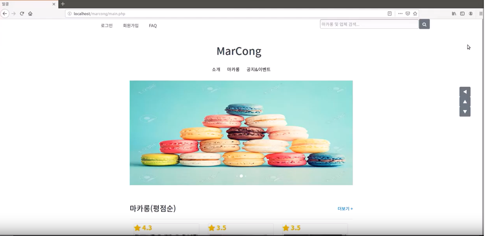
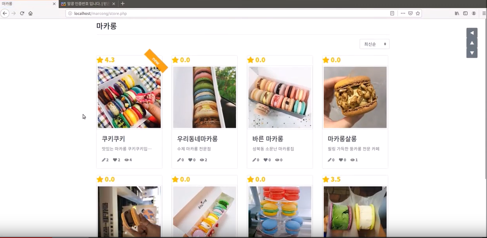

# marcong

> 맛집 마카롱을 줄서서 먹는 것 보단 예약을 해서 먹고 싶다는 생각으로 만들어진 웹사이트입니다.

## 사용 기술

- Framework & Library : Bootstrap, PHPMailer
- Language : JavaScript, jQuery, css, Php
- Database : mariaDB
- Server : Ubuntu

## 주요 기능

- 회원가입 / 로그인
- 이메일 인증
- 오늘의 뷰
- 장바구니 기능
- 관심상품(좋아요) 기능
- 카카오페이 결제
- 리뷰 작성(평점)
- 업체 계정에서 마카롱 업로드 및 수정, 삭제
- 업체 계정에서 주문확인
- 최신, 평점, 조회 순으로 정렬
- 공지 / 이벤트 검색

## 정보

이메일 주소 - jwh6295@gmail.com

영상 주소 - https://www.youtube.com/watch?v=6TP2qYogsdY&t=162s
